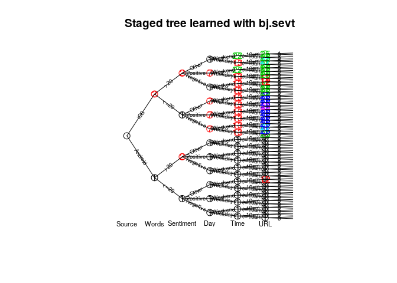

<!-- README.md is generated from README.Rmd. Please edit that file -->
stagedtrees
===========

[](https://travis-ci.com/gherardovarando/stagedtrees)

### Installation

``` r
#development version from github
# install.packages("devtools")
devtools::install_github("gherardovarando/stagedtrees")

#unstable development version from the dev branch
devtools::install_github("gherardovarando/stagedtrees", ref = "dev")
```

### Usage

``` r
library("stagedtrees")
```

With the `stagedtrees` package it is possible to fit (stratified) staged event trees to data, use them to compute probabilities, make predictions, visualize and compare different models.

#### Creating the model

A staged event tree object (`sevt` class) can be created with the function `staged_ev_tree`. In general we create a staged event tree from data in a `data.frame` or `table` object.

``` r
# Load the Trump tweets data
data("Trump")

# Create the independence model 
indep <- staged_ev_tree(Trump, lambda = 1)
indep
## Staged event tree (fitted) 
## Source[2] -> Words[2] -> Sentiment[3] -> Day[2] -> Time[2] -> URL[2]  
## 'log Lik.' -11868.2 (df=7)

#Create the full (saturated) model
full <- staged_ev_tree(Trump, full = TRUE, lambda = 1) 
full
## Staged event tree (fitted) 
## Source[2] -> Words[2] -> Sentiment[3] -> Day[2] -> Time[2] -> URL[2]  
## 'log Lik.' -10027.01 (df=95)
```

#### Model selection

Starting from the independence model of the full model it is
possible to perform automatic model selection.

##### Score methods

This methods perform optimization of the model for a given score using different types of heuristic methods.

-   **Hill-Climbing** `hc.sevt(object, score, max_iter, trace)`

``` r
mod1 <- hc.sevt(indep)
mod1
## Staged event tree (fitted) 
## Source[2] -> Words[2] -> Sentiment[3] -> Day[2] -> Time[2] -> URL[2]  
## 'log Lik.' -10060.23 (df=16)
```

-   **Backward Hill-Climbing** `bhc.sevt(object, score, max_iter, trace)`

``` r
mod2 <- bhc.sevt(full)
mod2
## Staged event tree (fitted) 
## Source[2] -> Words[2] -> Sentiment[3] -> Day[2] -> Time[2] -> URL[2]  
## 'log Lik.' -10032.62 (df=20)
```

-   **Backward Fast Hill-Climbing** `fbhc.sevt(object, score, max_iter, trace)`

``` r
mod3 <- fbhc.sevt(full, score = function(x) -BIC(x))
mod3
## Staged event tree (fitted) 
## Source[2] -> Words[2] -> Sentiment[3] -> Day[2] -> Time[2] -> URL[2]  
## 'log Lik.' -10075.96 (df=16)
```

##### Distance methods

-   **Backward Joining** `bj.sevt(full, distance, thr, trace, ...)`

``` r
mod4 <- bj.sevt(full)
mod4
## Staged event tree (fitted) 
## Source[2] -> Words[2] -> Sentiment[3] -> Day[2] -> Time[2] -> URL[2]  
## 'log Lik.' -10062.74 (df=18)
```

-   **Naive model** `naive.sevt(full, distance, k)`

``` r
mod5 <- naive.sevt(full)
mod5
## Staged event tree (fitted) 
## Source[2] -> Words[2] -> Sentiment[3] -> Day[2] -> Time[2] -> URL[2]  
## 'log Lik.' -10214.4 (df=13)
```

#### Probabilities and predictions

##### Marginal probabilities

Obtain marginal probabilities with the `prob.sevt` function.

``` r
# estimated probability of (Source = "iOS", Sentiment = "Negative")
# using different models
prob.sevt(indep, c(Source = "iOS", Sentiment = "Negative")) 
## [1] 0.1994159
prob.sevt(mod3, c(Source = "iOS", Sentiment = "Negative"))
## [1] 0.1646671
```

Or for a `data.frame` of observations:

``` r
obs <- expand.grid(full$tree[c(2,3,5)])
p <- prob.sevt(mod2, obs)
cbind(obs, P = p)
##    Words Sentiment   Time          P
## 1   <=20  Negative <=10am 0.02306711
## 2    >20  Negative <=10am 0.12653622
## 3   <=20  Positive <=10am 0.04933506
## 4    >20  Positive <=10am 0.07176951
## 5   <=20     Other <=10am 0.02637204
## 6    >20     Other <=10am 0.03101888
## 7   <=20  Negative  >10am 0.10120134
## 8    >20  Negative  >10am 0.14709251
## 9   <=20  Positive  >10am 0.15850574
## 10   >20  Positive  >10am 0.11137642
## 11  <=20     Other  >10am 0.11570095
## 12   >20     Other  >10am 0.03802423
```

##### Predictions

A staged event tree object can be used to make predictions with the `predict` method. The class variable can be specified, otherwise the first variable (root) in the tree will be used.

``` r
predicted <- predict(mod3, newdata = Trump)
table(predicted, Trump$Source)
##          
## predicted Android  iOS
##   Android    1262  315
##   iOS         108 1061
```

#### Explore the model

##### Plot

``` r
plot(mod4, main = "Staged tree learned with bj.sevt", 
     cex.label.edges = 0.6, cex.nodes = 1.5)
text(mod4, y = -0.03, cex = 0.7)
```



##### Stages

``` r
stageinfo.sevt(mod4, var = "Time")
## Stage  1 for variable Time 
##    12 nodes in the stage 
##    probabilities: <=10am      >10am 
##                   0.517       0.483      
##    sample size: 1370 
## --------------------------------
## Stage  13 for variable Time 
##    10 nodes in the stage 
##    probabilities: <=10am      >10am 
##                   0.144       0.856      
##    sample size: 1327 
## --------------------------------
## Stage  22 for variable Time 
##    2 nodes in the stage 
##    probabilities: <=10am      >10am 
##                   0.02       0.98      
##    sample size: 49 
## --------------------------------
```

##### Subtrees

Subtrees can be extracted, the result is another staged event tree object in the remaining variables.

``` r
sub <- subtree.sevt(mod4, c("iOS", ">20"))
plot(sub)
text(sub, y = -0.03, cex = 0.7)
```


#### Comparing models

Check if the models are equal.

``` r
compare.sevt(mod1, mod2)
## [1] FALSE
```

Penalized like-lihood.

``` r
BIC(mod1, mod2, mod3, mod4, mod5)
##      df      BIC
## mod1 16 20247.15
## mod2 20 20223.59
## mod3 16 20278.60
## mod4 18 20268.00
## mod5 13 20531.74
```
