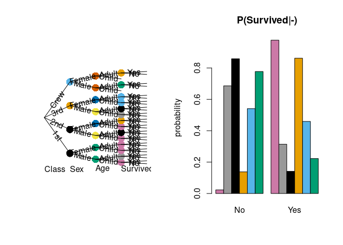

<!-- README.md is generated from README.Rmd. Please edit that file -->

# stagedtrees

[](https://cran.r-project.org/package=stagedtrees)
[](https://github.com/stagedtrees/stagedtrees/actions)
[](https://codecov.io/github/stagedtrees/stagedtrees?branch=main)
[](https://cran.r-project.org/package=stagedtrees)

##### Citation

To cite stagedtrees in publications use:

Carli F, Leonelli M, Riccomagno E, Varando G (2022). “The R Package
stagedtrees for Structural Learning of Stratified Staged Trees.”
*Journal of Statistical Software*, *102*(6), 1-30. doi:
10.18637/jss.v102.i06 (URL: <https://doi.org/10.18637/jss.v102.i06>).

    @Article{,
        title = {The {R} Package {stagedtrees} for Structural Learning of Stratified Staged Trees},
        author = {Federico Carli and Manuele Leonelli and Eva Riccomagno and Gherardo Varando},
        journal = {Journal of Statistical Software},
        year = {2022},
        volume = {102},
        number = {6},
        pages = {1--30},
        doi = {10.18637/jss.v102.i06},
      }

### Overview

`stagedtrees` is a package that implements staged event trees, a
probability model for categorical random variables.

### Installation

``` r
#stable version from CRAN 
install.packages("stagedtrees")

#development version from github
remotes::install_github("stagedtrees/stagedtrees", ref = "dev")
```

### Usage

With the `stagedtrees` package it is possible to estimate (stratified)
staged event trees from data, use them to compute probabilities, make
predictions, visualize and compare different models.

``` r
library("stagedtrees")

tree <- Titanic |> full() |> stages_bhc() |> stndnaming(uniq = TRUE)

prob(tree, c(Survived="Yes"), conditional_on = c(Age="Adult"))
#> [1] 0.3107124

palette("Okabe-Ito")
par(mfrow = c(1,2))
plot(tree, col = "stages")
barplot(tree, var = "Survived", main = "P(Survived|-)", col = "stages")
```

<!-- -->
