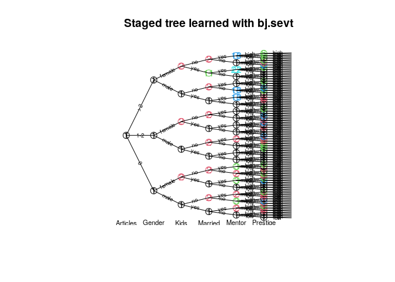
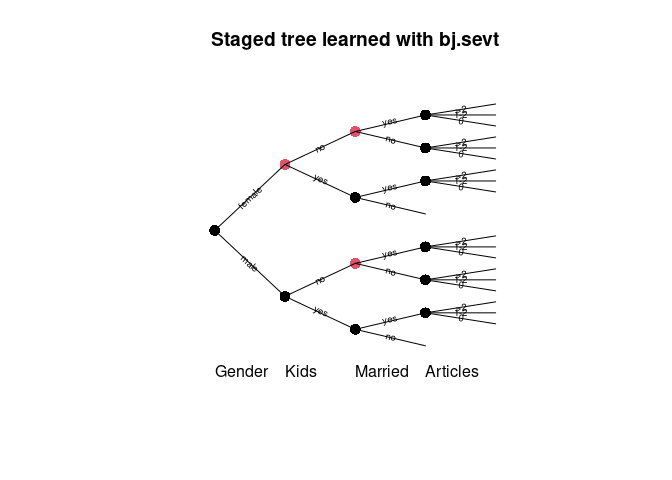
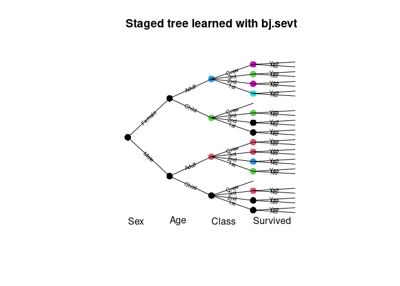

<!-- README.md is generated from README.Rmd. Please edit that file -->

# stagedtrees

[](https://travis-ci.com/gherardovarando/stagedtrees)
[](https://codecov.io/github/gherardovarando/stagedtrees?branch=master)
[](https://cran.r-project.org/package=stagedtrees)

### Overview

`stagedtrees` is a package that implements staged event trees, a
probability model for discrete random variables.

### Installation

``` r
#stable version from github 
install.packages("stagedtrees")

#development version from github
# install.packages("devtools")
devtools::install_github("gherardovarando/stagedtrees")
```

### Usage

``` r
library("stagedtrees")
```

With the `stagedtrees` package it is possible to fit (stratified) staged
event trees to data, use them to compute probabilities, make
predictions, visualize and compare different models.

#### Creating the model

A staged event tree object (`sevt` class) can be created with the
function `staged_ev_tree`, or with the functions `indep` and `full`. In
general we create a staged event tree from data in a `data.frame` or
`table` object.

``` r
# Load the PhDArticles data
data("PhDArticles")

# Create the independence model 
mod_indep <- indep(PhDArticles, lambda = 1)
mod_indep
#> Staged event tree (fitted) 
#> Articles[3] -> Gender[2] -> Kids[2] -> Married[2] -> Mentor[3] -> Prestige[2]  
#> 'log Lik.' -4407.498 (df=8)

#Create the full (saturated) model
mod_full <- full(PhDArticles, lambda = 1) 
mod_full
#> Staged event tree (fitted) 
#> Articles[3] -> Gender[2] -> Kids[2] -> Married[2] -> Mentor[3] -> Prestige[2]  
#> 'log Lik.' -4066.97 (df=143)
```

#### Model selection

Starting from the independence model of the full model it is  
possible to perform automatic model selection.

##### Score methods

This methods perform optimization of the model for a given score using
different types of heuristic methods.

  - **Hill-Climbing** `hc.sevt(object, score, max_iter, trace)`

<!-- end list -->

``` r
mod1 <- hc.sevt(mod_indep)
mod1
#> Staged event tree (fitted) 
#> Articles[3] -> Gender[2] -> Kids[2] -> Married[2] -> Mentor[3] -> Prestige[2]  
#> 'log Lik.' -4118.434 (df=14)
```

  - **Backward Hill-Climbing** `bhc.sevt(object, score, max_iter,
    trace)`

<!-- end list -->

``` r
mod2 <- bhc.sevt(mod_full)
mod2
#> Staged event tree (fitted) 
#> Articles[3] -> Gender[2] -> Kids[2] -> Married[2] -> Mentor[3] -> Prestige[2]  
#> 'log Lik.' -4086.254 (df=19)
```

  - **Backward Fast Hill-Climbing** `fbhc.sevt(object, score, max_iter,
    trace)`

<!-- end list -->

``` r
mod3 <- fbhc.sevt(mod_full, score = function(x) -BIC(x))
mod3
#> Staged event tree (fitted) 
#> Articles[3] -> Gender[2] -> Kids[2] -> Married[2] -> Mentor[3] -> Prestige[2]  
#> 'log Lik.' -4146.642 (df=14)
```

##### Distance methods

  - **Backward Joining** `bj.sevt(full, distance, thr, trace, ...)`

<!-- end list -->

``` r
mod4 <- bj.sevt(mod_full)
mod4
#> Staged event tree (fitted) 
#> Articles[3] -> Gender[2] -> Kids[2] -> Married[2] -> Mentor[3] -> Prestige[2]  
#> 'log Lik.' -4090.79 (df=22)
```

  - **Naive model** `naive.sevt(full, distance, k)`

<!-- end list -->

``` r
mod5 <- naive.sevt(mod_full)
mod5
#> Staged event tree (fitted) 
#> Articles[3] -> Gender[2] -> Kids[2] -> Married[2] -> Mentor[3] -> Prestige[2]  
#> 'log Lik.' -4118.437 (df=14)
```

#### Combining model selections with `%>%`

The pipe operator from the `magrittr` package can be used to combine
easily various model selection algorithms and to specify models easily.

``` r
library(magrittr)
model <- PhDArticles %>% full(lambda = 1) %>% naive.sevt %>% 
               hc.sevt

## extract a sub_tree and join two stages
sub_model <- model %>% subtree.sevt(path = c(">2"))  %>%  
              join_stages("Mentor", "1", "2")
```

#### Probabilities, predictions and sampling

##### Marginal probabilities

Obtain marginal probabilities with the `prob.sevt` function.

``` r
# estimated probability of c(Gender = "male", Married = "yes")
# using different models
prob.sevt(mod_indep, c(Gender = "male", Married = "yes")) 
#> [1] 0.3573183
prob.sevt(mod3, c(Gender = "male", Married = "yes"))
#> [1] 0.3934668
```

Or for a `data.frame` of observations:

``` r
obs <- expand.grid(mod_full$tree[c(2,3,5)])
p <- prob.sevt(mod2, obs)
cbind(obs, P = p)
#>    Gender Kids Mentor          P
#> 1    male  yes    low 0.07208877
#> 2  female  yes    low 0.03176117
#> 3    male   no    low 0.09832136
#> 4  female   no    low 0.11463987
#> 5    male  yes medium 0.09915181
#> 6  female  yes medium 0.03452265
#> 7    male   no medium 0.10643086
#> 8  female   no medium 0.14830958
#> 9    male  yes   high 0.08660225
#> 10 female  yes   high 0.02187397
#> 11   male   no   high 0.07702539
#> 12 female   no   high 0.10927233
```

##### Predictions

A staged event tree object can be used to make predictions with the
`predict` method. The class variable can be specified, otherwise the
first variable (root) in the tree will be used.

``` r
## check accuracy over the PhDArticles data
predicted <- predict(mod3, newdata = PhDArticles)
table(predicted, PhDArticles$Articles)
#>          
#> predicted   0 1-2  >2
#>       0    32  34  19
#>       1-2 225 351 149
#>       >2   18  39  48
```

Conditional probabilities (or log-) can be obtained setting `prob =
TRUE`:

``` r
## obtain estimated conditional probabilities in mod3 for first 5 obs
## P(Articles|Gender, Kids, Married, Mentor, Prestige)
predict(mod3, newdata = PhDArticles[1:5,], prob = TRUE)
#>           0       1-2        >2
#> 1 0.2853346 0.4393739 0.2752915
#> 2 0.3186093 0.4906121 0.1907785
#> 3 0.3186093 0.4906121 0.1907785
#> 4 0.3450547 0.5313342 0.1236111
#> 5 0.2304826 0.6315078 0.1380096
```

##### Sampling

``` r
sample.sevt(mod4, 5)
#>   Articles Gender Kids Married Mentor Prestige
#> 1       >2   male   no      no   high     high
#> 2      1-2   male   no      no    low     high
#> 3      1-2 female  yes     yes    low      low
#> 4      1-2   male   no     yes   high     high
#> 5      1-2 female   no      no   high     high
```

#### Explore the model

##### Model info

``` r
# Degrees of freedom
df.sevt(mod_full)
#> [1] 143
df.sevt(mod_indep)
#> [1] 8

# variables 
varnames.sevt(mod1)
#> [1] "Articles" "Gender"   "Kids"     "Married"  "Mentor"   "Prestige"

# number of variables
nvar.sevt(mod1)
#> [1] 6
```

##### Plot

``` r
plot(mod4, main = "Staged tree learned with bj.sevt", 
     cex.label.edges = 0.6, cex.nodes = 1.5)
text(mod4, y = -0.03, cex = 0.7)
```

<!-- -->

##### Stages

``` r
stages.sevt(mod4, "Kids")
#> [1] "1" "2" "1" "2" "1" "2"
```

``` r
summary(mod4)
#> Call: 
#> bj.sevt(mod_full)
#> lambda:  1 
#> Stages: 
#>   Variable:  Articles 
#>  stage npaths sample.size         0      1-2        >2
#>      1      0         915 0.3006536 0.462963 0.2363834
#>   ------------ 
#>   Variable:  Gender 
#>  stage npaths sample.size      male    female
#>      1      3         915 0.5398037 0.4601963
#>   ------------ 
#>   Variable:  Kids 
#>  stage npaths sample.size       yes        no
#>      1      3         494 0.4778226 0.5221774
#>      2      3         421 0.1914894 0.8085106
#>   ------------ 
#>   Variable:  Married 
#>  stage npaths sample.size          no       yes
#>      1      5         303 0.003278689 0.9967213
#>      2      6         599 0.515806988 0.4841930
#>     11      1          13 0.066666667 0.9333333
#>   ------------ 
#>   Variable:  Mentor 
#>  stage npaths sample.size       low    medium       high
#>      1     13         431 0.2557604 0.4377880 0.30645161
#>      2      4         242 0.4367347 0.3346939 0.22857143
#>      3      3         102 0.5142857 0.4000000 0.08571429
#>     18      3         127 0.1307692 0.3384615 0.53076923
#>     22      1          13 0.4375000 0.1875000 0.37500000
#>   ------------ 
#>   Variable:  Prestige 
#>  stage npaths sample.size       low      high
#>      1     36         338 0.5323529 0.4676471
#>      4     14         274 0.6920290 0.3079710
#>      6     15         194 0.3622449 0.6377551
#>      8      7         109 0.1801802 0.8198198
#>   ------------
```

##### Subtrees

A subtree can be extracted, the result is another staged event tree
object in the remaining variables.

``` r
sub <- subtree.sevt(mod4, c(">2", "female"))
plot(sub)
text(sub, y = -0.03, cex = 0.7)
```

<!-- -->

#### Comparing models

Check if models are equal.

``` r
compare.sevt(mod1, mod2)
#> [1] FALSE

compare.sevt(mod1, mod2, method = "hamming", plot = TRUE, 
             cex.label.nodes = 0, cex.label.edges = 0)
#> [1] FALSE
text(mod1)
```

<!-- -->

``` r

hamming.sevt(mod1, mod2)
#> [1] 43

difftree <- compare.sevt(mod1, mod2, method = "stages", plot = FALSE, 
             return.tree = TRUE)

difftree$Married
#>  [1] 0 1 0 1 0 1 0 1 0 1 0 1
```

Penalized log-likelihood.

``` r
BIC(mod_indep, mod_full, mod1, mod2, mod3, mod4, mod5)
#>            df      BIC
#> mod_indep   8 8869.548
#> mod_full  143 9109.046
#> mod1       14 8332.333
#> mod2       19 8302.067
#> mod3       14 8388.749
#> mod4       22 8331.596
#> mod5       14 8332.338
```
