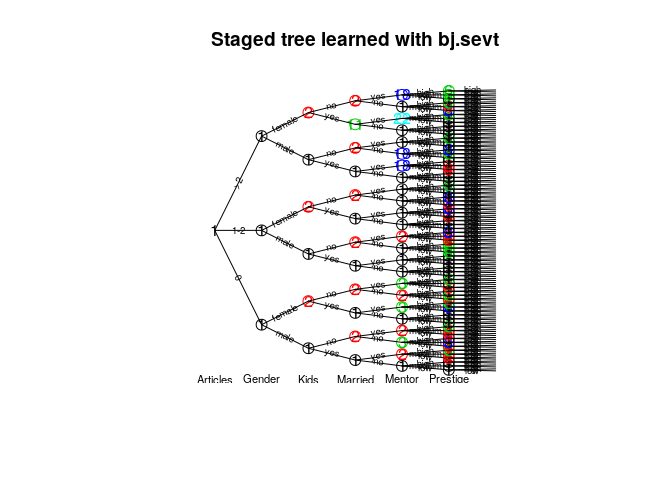
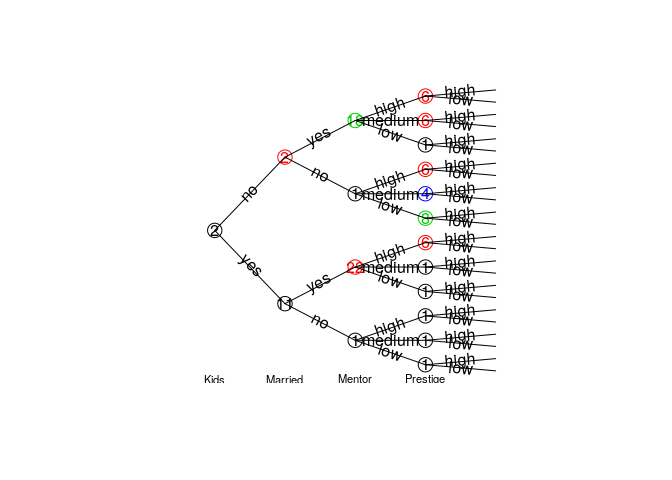

<!-- README.md is generated from README.Rmd. Please edit that file -->
stagedtrees
===========

[](https://travis-ci.com/gherardovarando/stagedtrees) [](https://codecov.io/github/gherardovarando/stagedtrees?branch=master)

### Installation

``` r
#development version from github
# install.packages("devtools")
devtools::install_github("gherardovarando/stagedtrees")

#unstable development version from the dev branch
devtools::install_github("gherardovarando/stagedtrees", ref = "dev")
```

### Usage

``` r
library("stagedtrees")
```

With the `stagedtrees` package it is possible to fit (stratified) staged event trees to data, use them to compute probabilities, make predictions, visualize and compare different models.

#### Creating the model

A staged event tree object (`sevt` class) can be created with the function `staged_ev_tree`, or with the functions `indep` and `full`. In general we create a staged event tree from data in a `data.frame` or `table` object.

``` r
# Load the PhDArticles data
data("PhDArticles")

# Create the independence model 
mod_indep <- indep(PhDArticles, lambda = 1)
mod_indep
## Staged event tree (fitted) 
## Articles[3] -> Gender[2] -> Kids[2] -> Married[2] -> Mentor[3] -> Prestige[2]  
## 'log Lik.' -4407.498 (df=8)

#Create the full (saturated) model
mod_full <- full(PhDArticles, lambda = 1) 
mod_full
## Staged event tree (fitted) 
## Articles[3] -> Gender[2] -> Kids[2] -> Married[2] -> Mentor[3] -> Prestige[2]  
## 'log Lik.' -4066.97 (df=143)
```

#### Model selection

Starting from the independence model of the full model it is
possible to perform automatic model selection.

##### Score methods

This methods perform optimization of the model for a given score using different types of heuristic methods.

-   **Hill-Climbing** `hc.sevt(object, score, max_iter, trace)`

``` r
mod1 <- hc.sevt(mod_indep)
mod1
## Staged event tree (fitted) 
## Articles[3] -> Gender[2] -> Kids[2] -> Married[2] -> Mentor[3] -> Prestige[2]  
## 'log Lik.' -4118.434 (df=14)
```

-   **Backward Hill-Climbing** `bhc.sevt(object, score, max_iter, trace)`

``` r
mod2 <- bhc.sevt(mod_full)
mod2
## Staged event tree (fitted) 
## Articles[3] -> Gender[2] -> Kids[2] -> Married[2] -> Mentor[3] -> Prestige[2]  
## 'log Lik.' -4086.254 (df=19)
```

-   **Backward Fast Hill-Climbing** `fbhc.sevt(object, score, max_iter, trace)`

``` r
mod3 <- fbhc.sevt(mod_full, score = function(x) -BIC(x))
mod3
## Staged event tree (fitted) 
## Articles[3] -> Gender[2] -> Kids[2] -> Married[2] -> Mentor[3] -> Prestige[2]  
## 'log Lik.' -4146.642 (df=14)
```

##### Distance methods

-   **Backward Joining** `bj.sevt(full, distance, thr, trace, ...)`

``` r
mod4 <- bj.sevt(mod_full)
mod4
## Staged event tree (fitted) 
## Articles[3] -> Gender[2] -> Kids[2] -> Married[2] -> Mentor[3] -> Prestige[2]  
## 'log Lik.' -4090.79 (df=22)
```

-   **Naive model** `naive.sevt(full, distance, k)`

``` r
mod5 <- naive.sevt(mod_full)
mod5
## Staged event tree (fitted) 
## Articles[3] -> Gender[2] -> Kids[2] -> Married[2] -> Mentor[3] -> Prestige[2]  
## 'log Lik.' -4118.437 (df=14)
```

#### Probabilities, predictions and sampling

##### Marginal probabilities

Obtain marginal probabilities with the `prob.sevt` function.

``` r
# estimated probability of c(Gender = "male", Married = "yes")
# using different models
prob.sevt(mod_indep, c(Gender = "male", Married = "yes")) 
## [1] 0.3573183
prob.sevt(mod3, c(Gender = "male", Married = "yes"))
## [1] 0.3934668
```

Or for a `data.frame` of observations:

``` r
obs <- expand.grid(mod_full$tree[c(2,3,5)])
p <- prob.sevt(mod2, obs)
cbind(obs, P = p)
##    Gender Kids Mentor          P
## 1    male  yes    low 0.07208877
## 2  female  yes    low 0.03176117
## 3    male   no    low 0.09832136
## 4  female   no    low 0.11463987
## 5    male  yes medium 0.09915181
## 6  female  yes medium 0.03452265
## 7    male   no medium 0.10643086
## 8  female   no medium 0.14830958
## 9    male  yes   high 0.08660225
## 10 female  yes   high 0.02187397
## 11   male   no   high 0.07702539
## 12 female   no   high 0.10927233
```

##### Predictions

A staged event tree object can be used to make predictions with the `predict` method. The class variable can be specified, otherwise the first variable (root) in the tree will be used.

``` r
predicted <- predict(mod3, newdata = PhDArticles)
table(predicted, PhDArticles$Articles)
##          
## predicted   0 1-2  >2
##       0    32  34  19
##       1-2 225 351 149
##       >2   18  39  48
```

##### Sampling

``` r
sample.sevt(mod4, 5)
##   Articles Gender Kids Married Mentor Prestige
## 1       >2   male   no      no   high     high
## 2      1-2 female   no     yes   high      low
## 3       >2 female   no      no medium     high
## 4      1-2   male  yes     yes medium     high
## 5       >2 female   no      no medium     high
```

#### Explore the model

##### Model info

``` r
# Degrees of freedom
df.sevt(mod_full)
## [1] 143
df.sevt(mod_indep)
## [1] 8

# variables 
varnames.sevt(mod1)
## [1] "Articles" "Gender"   "Kids"     "Married"  "Mentor"   "Prestige"

# number of variables
nvar.sevt(mod1)
## [1] 6
```

##### Plot

``` r
plot(mod4, main = "Staged tree learned with bj.sevt", 
     cex.label.edges = 0.6, cex.nodes = 1.5)
text(mod4, y = -0.03, cex = 0.7)
```



##### Stages

``` r
stages.sevt(mod4, "Kids")
## [1] "1" "2" "1" "2" "1" "2"
```

``` r
stageinfo.sevt(mod4, var = "Kids")
## Stage  1 for variable Kids 
##    3 nodes in the stage 
##    probabilities: yes      no 
##                   0.478    0.522   
##    sample size: 494 
## --------------------------------
## Stage  2 for variable Kids 
##    3 nodes in the stage 
##    probabilities: yes      no 
##                   0.191    0.809   
##    sample size: 421 
## --------------------------------
```

##### Subtrees

A subtree can be extracted, the result is another staged event tree object in the remaining variables.

``` r
sub <- subtree.sevt(mod4, c(">2", "female"))
plot(sub)
text(sub, y = -0.03, cex = 0.7)
```



#### Comparing models

Check if models are equal.

``` r
compare.sevt(mod1, mod2)
## [1] FALSE

compare.sevt(mod1, mod2, method = "hamming", plot = TRUE, 
             cex.label.nodes = 0, cex.label.edges = 0)
## [1] FALSE
text(mod1)
```


``` r

hamming.sevt(mod1, mod2)
## [1] 43

difftree <- compare.sevt(mod1, mod2, method = "stages", plot = FALSE, 
             return.tree = TRUE)

difftree$Married
##  [1] 0 1 0 1 0 1 0 1 0 1 0 1
```

Penalized log-likelihood.

``` r
BIC(mod_indep, mod_full, mod1, mod2, mod3, mod4, mod5)
##            df      BIC
## mod_indep   8 8869.548
## mod_full  143 9109.046
## mod1       14 8332.333
## mod2       19 8302.067
## mod3       14 8388.749
## mod4       22 8331.596
## mod5       14 8332.338
```
