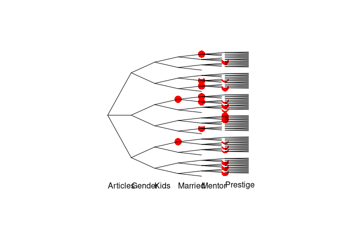
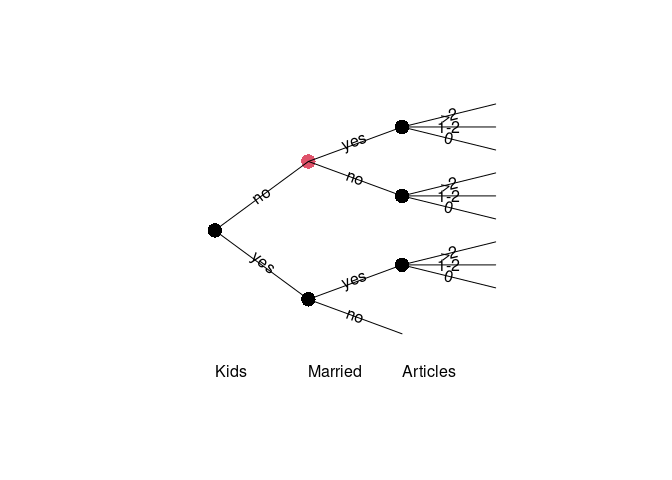
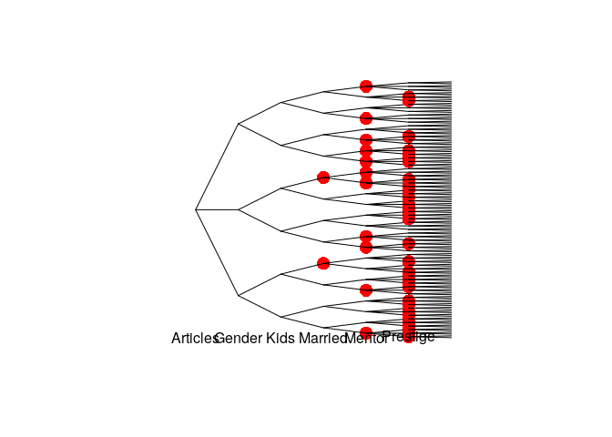
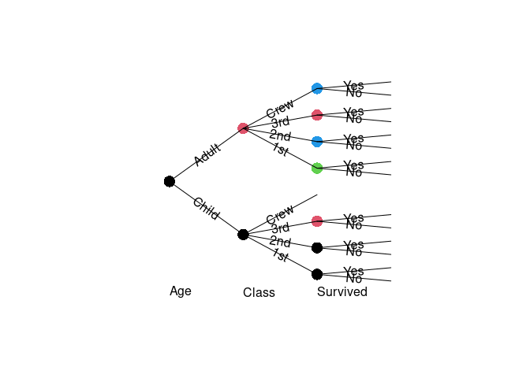
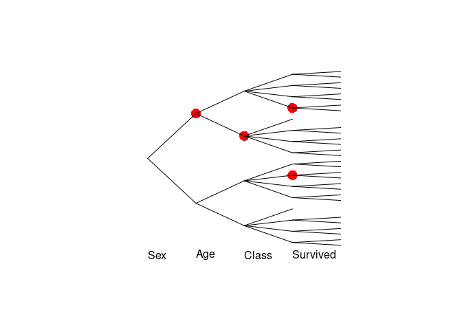

<!-- README.md is generated from README.Rmd. Please edit that file -->

# stagedtrees

[](https://cran.r-project.org/package=stagedtrees)
[](https://travis-ci.com/gherardovarando/stagedtrees)
[](https://github.com/gherardovarando/stagedtrees/actions)
[](https://codecov.io/github/gherardovarando/stagedtrees?branch=main)
[](https://cran.r-project.org/package=stagedtrees)

##### Preprint

F Carli, M Leonelli, E Riccomagno, G Varando, The R Package stagedtrees
for Structural Learning of Stratified Staged Trees, 2020
[arXiv:2004.06459](https://arxiv.org/abs/2004.06459)

    @misc{2004.06459,
    Author = {Federico Carli and Manuele Leonelli and Eva Riccomagno and Gherardo Varando},
    Title = {The R Package stagedtrees for Structural Learning of Stratified Staged Trees},
    Year = {2020},
    Eprint = {arXiv:2004.06459},
    }

### Overview

`stagedtrees` is a package that implements staged event trees, a
probability model for categorical random variables.

### Installation

``` r
#stable version from CRAN 
install.packages("stagedtrees")

#development version from github
# install.packages("devtools")
devtools::install_github("gherardovarando/stagedtrees")
```

### Usage

``` r
library("stagedtrees")
```

With the `stagedtrees` package it is possible to fit (stratified) staged
event trees to data, use them to compute probabilities, make
predictions, visualize and compare different models.

#### Creating the model

A staged event tree object (`sevt` class) can be initialized as the full
(saturated) or as the fully independent model with, respectively, the
functions `indep` and `full`. It is possible to build a staged event
tree from data stored in a `data.frame` or a `table` object.

``` r
# Load the PhDArticles data
data("Titanic")

# define order of variables
order <- c("Sex", "Age",  "Class", "Survived")

# Independence model 
mod_indep <- indep(Titanic, order)
mod_indep
#> Staged event tree (fitted) 
#> Sex[2] -> Age[2] -> Class[4] -> Survived[2]  
#> 'log Lik.' -5773.349 (df=7)

# Full (saturated) model
mod_full <- full(Titanic, order) 
mod_full
#> Staged event tree (fitted) 
#> Sex[2] -> Age[2] -> Class[4] -> Survived[2]  
#> 'log Lik.' -5151.517 (df=30)
```

##### Structural zeros and unobserved situations

By default staged trees object are defined assuming structural zeros in
the contingency tables. This is implemented by joining all unobserved
situations in particular stages (named by default `"UNOBSERVED"`) which
are, by default, ignored by other methods and functions (see the
`ignore` argument in `?stages_bhc` or `?plot.sevt`).

``` r
## there are no observations for Sex=Male (Female), Age = Child, Class = Crew
get_stage(mod_full, c("Male", "Child", "Crew"))
#> [1] "UNOBSERVED"

## and obviously 
prob(mod_full, c(Age = "CHild", CLass = "Crew"))
#> [1] 0
```

###### Initialize a model without structural zeros

It is possible to initialize a staged tree without structural zeros by
setting the argument `join_unobserved=FALSE`. In that case, it can be
useful to set `lambda > 0` to avoid problems with probabilities on
unobserved situations.

``` r
mod_full0 <- full(Titanic, join_unobserved = FALSE, lambda = 1)
```

#### Model selection

`stagedtrees` implements methods to perform automatic model selection.
All methods can be initialized from an arbitrary staged event tree
object.

##### Score methods

This methods perform optimization for a given score using different
heuristics.

-   **Hill-Climbing**
    `stages_hc(object, score, max_iter, scope, ignore, trace)`

``` r
mod1 <- stages_hc(mod_indep)
mod1
#> Staged event tree (fitted) 
#> Sex[2] -> Age[2] -> Class[4] -> Survived[2]  
#> 'log Lik.' -5161.242 (df=18)
```

-   **Backward Hill-Climbing**
    `stages_bhc(object, score, max_iter, scope, ignore, trace)`

``` r
mod2 <- stages_bhc(mod_full)
mod2
#> Staged event tree (fitted) 
#> Sex[2] -> Age[2] -> Class[4] -> Survived[2]  
#> 'log Lik.' -5157.759 (df=19)
```

-   **Backward Fast Hill-Climbing**
    `stages_fbhc(object, score, max_iter, scope, ignore, trace)`

``` r
mod3 <- stages_fbhc(mod_full, score = function(x) -BIC(x))
mod3
#> Staged event tree (fitted) 
#> Sex[2] -> Age[2] -> Class[4] -> Survived[2]  
#> 'log Lik.' -5164.708 (df=18)
```

##### Clustering methods

-   **Backward Joining**
    `stages_bj(object, distance, thr, scope, ignore, trace)`

``` r
mod4 <- stages_bj(mod_full)
mod4
#> Staged event tree (fitted) 
#> Sex[2] -> Age[2] -> Class[4] -> Survived[2]  
#> 'log Lik.' -5170.769 (df=21)
```

-   **Hierarchical Clustering**
    `stages_hclust(object, distance, k, method, ignore, limit, scope)`

``` r
mod5 <- stages_hclust(mod_full,
                    k = 2, 
                    distance = "totvar",
                   method = "mcquitty")
mod5
#> Staged event tree (fitted) 
#> Sex[2] -> Age[2] -> Class[4] -> Survived[2]  
#> 'log Lik.' -5241.629 (df=12)
```

-   **K-Means Clustering**
    `stages_kmeans(object, k, algorithm, ignore, limit, scope, nstart)`

``` r
mod6 <- stages_kmeans(mod_full,
                    k = 2, 
                   algorithm = "Hartigan-Wong")
mod6
#> Staged event tree (fitted) 
#> Sex[2] -> Age[2] -> Class[4] -> Survived[2]  
#> 'log Lik.' -5241.629 (df=12)
```

#### Combining model selections with `|>` (or `%>%`)

The new native pipe operator `|>` (or the one from the `magrittr`
package) can be used to combine various model selection algorithms.

``` r
model <- Titanic |> full(lambda = 1) |> stages_hclust() |> stages_hc()

## extract a sub_tree and join two stages
small_model <- model |> subtree(path = c("Crew"))  |>
              join_stages("Survived", "3", "7")
```

#### Probabilities, predictions and sampling

##### Marginal probabilities

Obtain marginal (or conditionals) probabilities with the `prob`
function.

``` r
# estimated probability of c(Sex = "Male", Class = "1st")
# using different models
prob(mod_indep, c(Sex = "Male", Class = "1st")) 
#> [1] 0.1161289
prob(mod3, c(Sex = "Male", Class = "1st"))
#> [1] 0.08110992
```

Or for a `data.frame` of observations:

``` r
obs <- expand.grid(mod_full$tree[c(1,3)])
p <- prob(mod2, obs)
cbind(obs, P = p)
#>      Sex Class          P
#> 1   Male   1st 0.08110992
#> 2 Female   1st 0.06655023
#> 3   Male   2nd 0.08273137
#> 4 Female   2nd 0.04675523
#> 5   Male   3rd 0.23097925
#> 6 Female   3rd 0.08978404
#> 7   Male  Crew 0.39164016
#> 8 Female  Crew 0.01044980
```

Conditional probabilities can be obtained via the `conditional_on`
argument.

``` r
prob(mod3, c(Sex = "Male", Class = "1st"),       
     conditional_on = c(Survived = "Yes"))
#> [1] 0.09876727
```

##### Predictions

A staged event tree object can be used to make predictions with the
`predict` method. The class variable can be specified, otherwise the
first variable (root) in the tree will be used.

``` r
## check accuracy over the Titanic data
titanic_df <- as.data.frame(Titanic)
predicted <- predict(mod3, class = "Survived", newdata = titanic_df)
table(predicted, titanic_df$Survived)
#>          
#> predicted No Yes
#>       No   7   7
#>       Yes  7   7
```

Conditional probabilities (or log-) can be obtained setting
`prob = TRUE`:

``` r
## obtain estimated conditional probabilities in mod3 
predict(mod3, newdata = titanic_df[1:3,], prob = TRUE)
#>       Male   Female
#> 1 0.587156 0.412844
#> 2 0.587156 0.412844
#> 3 0.587156 0.412844
```

##### Sampling

``` r
sample_from(mod4, 5)
#>    Sex   Age Class Survived
#> 1 Male Adult  Crew       No
#> 2 Male Adult   3rd       No
#> 3 Male Adult  Crew      Yes
#> 4 Male Adult   3rd       No
#> 5 Male Adult   3rd       No
```

#### Explore the model

##### Model info

``` r
# stages
stages(mod1, "Age")
#> [1] "3" "1"

# summary
summary(mod1)
#> Call: 
#> stages_hc(mod_indep)
#> lambda:  0 
#> Stages: 
#>   Variable:  Sex 
#>  stage npaths sample.size      Male    Female
#>      1      0        2201 0.7864607 0.2135393
#>   ------------ 
#>   Variable:  Age 
#>  stage npaths sample.size      Child     Adult
#>      3      1        1731 0.03697285 0.9630272
#>      1      1         470 0.09574468 0.9042553
#>   ------------ 
#>   Variable:  Class 
#>  stage npaths sample.size        1st       2nd       3rd       Crew
#>      1      2         109 0.05504587 0.2201835 0.7247706 0.00000000
#>      3      1        1667 0.10497900 0.1007798 0.2771446 0.51709658
#>      4      1         425 0.33882353 0.2188235 0.3882353 0.05411765
#>   ------------ 
#>   Variable:  Survived 
#>       stage npaths sample.size         No       Yes
#>           4      5         174 0.02298851 0.9770115
#>           1      2         910 0.77472527 0.2252747
#>  UNOBSERVED      2           0         NA        NA
#>           6      3         371 0.60377358 0.3962264
#>           7      2         630 0.85873016 0.1412698
#>           5      2         116 0.13793103 0.8620690
#>   ------------

# confidence intervals
confint(mod1, parm = "Age")
#>                  2.5 %    97.5 %
#> Age=Child|3 0.02808370 0.0458620
#> Age=Adult|3 0.95413800 0.9719163
#> Age=Child|1 0.06914343 0.1223459
#> Age=Adult|1 0.87765407 0.9308566
```

##### Plot

``` r
plot(mod4, main = "Staged tree learned with bj.sevt", 
     cex_label_edges = 0.6, cex_nodes = 1.5)
```

<!-- -->

By default stages associated with the unobserved situations are not
plotted, if the model has been created with `join_unobserved = TRUE`.
But we can plot also the unobserved stages in a specific color.

``` r
plot(stndnaming(mod5, uniq = TRUE), 
     main = "Staged tree learned with stages_hclust 
     (unobserved in grey)",  
     ignore = FALSE, ## do not ignore stages
     col = function(stages) ifelse(stages=="UNOBSERVED", "grey", stages),
     cex_label_edges = 0.6, cex_nodes = 1.5)
```

<!-- -->

###### Barplot

The method `barplot.sevt` creates a bar plot for the conditional
probabilities of a variable.

``` r
barplot(mod4, "Class", legend.text = TRUE)
```

<!-- -->

###### CEG plots

Plotting CEG requires the `igraph` package.

``` r
plot(ceg(mod5))
```

<!-- -->

##### Subtrees

From a staged evnt tree a subtree can be extracted, the resulting model
is ar staged event tree in the remaining variables.

``` r
sub <- subtree(mod4, c("Female"))
plot(sub)
```

<!-- -->

#### Comparing models

##### Compare stages structure

``` r
compare_stages(mod1, mod4)
#> [1] FALSE

compare_stages(mod1, mod4, method = "hamming", plot = TRUE, 
             cex_label_nodes = 0, cex_label_edges = 0)
```

<!-- -->

    #> [1] FALSE

    hamming_stages(mod1, mod4)
    #> [1] 4

    difftree <- compare_stages(mod1, mod4, method = "stages", plot = FALSE, 
                 return_tree = TRUE)

    difftree$Married
    #> NULL

##### Penalized log-likelihood.

``` r
BIC(mod_indep, mod_full, mod1, mod2, mod3, mod4, mod5)
#>           df      BIC
#> mod_indep  7 11600.57
#> mod_full  30 10533.93
#> mod1      18 10461.02
#> mod2      19 10461.76
#> mod3      18 10467.96
#> mod4      21 10503.17
#> mod5      12 10575.62
```

##### Likelihood-ratio test

``` r
mod1a <- join_stages(mod1, "Class", "3", "4")
lr_test(mod1a, mod1)
#> Likelihood-ratio test 
#> 
#> Sex[2] -> Age[2] -> Class[4] -> Survived[2] 
#> Model 1: mod1a
#> Model 2: mod1
#>   #Df  LogLik Df  Chisq Pr(>Chisq)    
#> 1  15 -5359.6                         
#> 2  18 -5161.2  3 396.65  < 2.2e-16 ***
#> ---
#> Signif. codes:  0 '***' 0.001 '**' 0.01 '*' 0.05 '.' 0.1 ' ' 1
```
