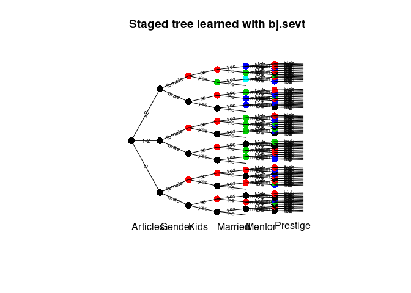
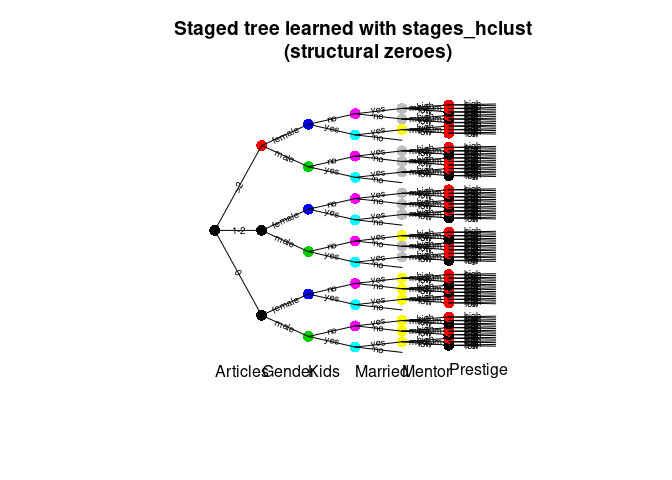
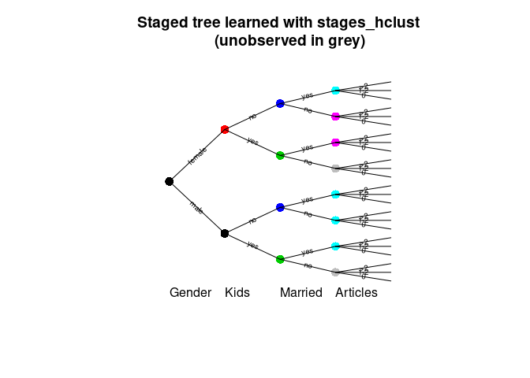

<!-- README.md is generated from README.Rmd. Please edit that file -->

# stagedtrees

[](https://cran.r-project.org/package=stagedtrees)
[](https://travis-ci.com/gherardovarando/stagedtrees)
[](https://codecov.io/github/gherardovarando/stagedtrees?branch=master)
[](https://cran.r-project.org/package=stagedtrees)

##### (almost) v2.0.0

The current version of `stagedtrees` available on github is a major
update over the previous version (1.0.2). The update will almost surely
break any code written with v1.0.2. Functions naming and functions
parameters have been updated to simplify user experience. Check the
[complete changelog](NEWS.md) for details.

##### Preprint

F Carli, M Leonelli, E Riccomagno, G Varando, The R Package stagedtrees
for Structural Learning of Stratified Staged Trees, 2020
[arXiv:2004.06459](https://arxiv.org/abs/2004.06459)

    @misc{2004.06459,
    Author = {Federico Carli and Manuele Leonelli and Eva Riccomagno and Gherardo Varando},
    Title = {The R Package stagedtrees for Structural Learning of Stratified Staged Trees},
    Year = {2020},
    Eprint = {arXiv:2004.06459},
    }

### Overview

`stagedtrees` is a package that implements staged event trees, a
probability model for discrete random variables.

### Installation

``` r
#stable version from CRAN 
install.packages("stagedtrees")

#development version from github
# install.packages("devtools")
devtools::install_github("gherardovarando/stagedtrees")
```

### Usage

``` r
library("stagedtrees")
```

With the `stagedtrees` package it is possible to fit (stratified) staged
event trees to data, use them to compute probabilities, make
predictions, visualize and compare different models.

#### Creating the model

A staged event tree object (`sevt` class) can be created with the
function `staged_ev_tree`, or with the functions `indep` and `full`. In
general we create a staged event tree from data in a `data.frame` or
`table` object.

``` r
# Load the PhDArticles data
data("PhDArticles")

# Independence model 
mod_indep <- indep(PhDArticles, lambda = 1)
mod_indep
#> Staged event tree (fitted) 
#> Articles[3] -> Gender[2] -> Kids[2] -> Married[2] -> Mentor[3] -> Prestige[2]  
#> 'log Lik.' -4407.498 (df=8)

# Full (saturated) model
mod_full <- full(PhDArticles, lambda = 1) 
mod_full
#> Staged event tree (fitted) 
#> Articles[3] -> Gender[2] -> Kids[2] -> Married[2] -> Mentor[3] -> Prestige[2]  
#> 'log Lik.' -4066.97 (df=143)

# Full model with not-observed situations joined in NA stages
mod_full0 <- full(PhDArticles, join_unobserved = TRUE, lambda = 1)
mod_full0
#> Staged event tree (fitted) 
#> Articles[3] -> Gender[2] -> Kids[2] -> Married[2] -> Mentor[3] -> Prestige[2]  
#> 'log Lik.' -4066.97 (df=116)
```

#### Model selection

`stagedtrees` implements methods to perform automatic model selection.
All methods can be initialized from an arbitrary staged event tree
object.

##### Score methods

This methods perform optimization for a given score using different
heuristics.

  - **Hill-Climbing** `stages_hc(object, score, max_iter, scope, ignore,
    trace)`

<!-- end list -->

``` r
mod1 <- stages_hc(mod_indep)
mod1
#> Staged event tree (fitted) 
#> Articles[3] -> Gender[2] -> Kids[2] -> Married[2] -> Mentor[3] -> Prestige[2]  
#> 'log Lik.' -4118.434 (df=14)
```

  - **Backward Hill-Climbing** `stages_bhc(object, score, max_iter,
    scope, ignore, trace)`

<!-- end list -->

``` r
mod2 <- stages_bhc(mod_full)
mod2
#> Staged event tree (fitted) 
#> Articles[3] -> Gender[2] -> Kids[2] -> Married[2] -> Mentor[3] -> Prestige[2]  
#> 'log Lik.' -4086.254 (df=19)
```

  - **Backward Fast Hill-Climbing** `stages_fbhc(object, score,
    max_iter, scope, ignore, trace)`

<!-- end list -->

``` r
mod3 <- stages_fbhc(mod_full, score = function(x) -BIC(x))
mod3
#> Staged event tree (fitted) 
#> Articles[3] -> Gender[2] -> Kids[2] -> Married[2] -> Mentor[3] -> Prestige[2]  
#> 'log Lik.' -4146.642 (df=14)
```

##### Distance methods

  - **Backward Joining** `stages_bj(object, distance, thr, scope,
    ignore, trace)`

<!-- end list -->

``` r
mod4 <- stages_bj(mod_full)
mod4
#> Staged event tree (fitted) 
#> Articles[3] -> Gender[2] -> Kids[2] -> Married[2] -> Mentor[3] -> Prestige[2]  
#> 'log Lik.' -4090.79 (df=22)
```

##### Clustering methods

  - **Hierarchical Clustering** `stages_hclust(object, distance, k,
    method, ignore, limit, scope)`

<!-- end list -->

``` r
mod5 <- stages_hclust(mod_full0,
                    k = 2, 
                    distance = "totvar",
                   method = "mcquitty")
mod5
#> Staged event tree (fitted) 
#> Articles[3] -> Gender[2] -> Kids[2] -> Married[2] -> Mentor[3] -> Prestige[2]  
#> 'log Lik.' -4122.274 (df=17)
```

  - **K-Means Clustering** `stages_kmeans(object, k, algorithm, ignore,
    limit, scope, nstart)`

<!-- end list -->

``` r
mod6 <- stages_kmeans(mod_full0,
                    k = 2, 
                   algorithm = "Hartigan-Wong")
mod6
#> Staged event tree (fitted) 
#> Articles[3] -> Gender[2] -> Kids[2] -> Married[2] -> Mentor[3] -> Prestige[2]  
#> 'log Lik.' -4119.247 (df=17)
```

#### Combining model selections with `%>%`

The pipe operator from the `magrittr` package can be used to combine
easily various model selection algorithms and to specify models easily.

``` r
library(magrittr)
model <- PhDArticles %>% full(lambda = 1) %>% 
           stages_hclust %>% stages_hc

## extract a sub_tree and join two stages
sub_model <- model %>% subtree(path = c(">2"))  %>%  
              join_stages("Mentor", "1", "2")
```

#### Probabilities, predictions and sampling

##### Marginal probabilities

Obtain marginal probabilities with the `prob` function.

``` r
# estimated probability of c(Gender = "male", Married = "yes")
# using different models
prob(mod_indep, c(Gender = "male", Married = "yes")) 
#> [1] 0.3573183
prob(mod3, c(Gender = "male", Married = "yes"))
#> [1] 0.3934668
```

Or for a `data.frame` of observations:

``` r
obs <- expand.grid(mod_full$tree[c(2,3,5)])
p <- prob(mod2, obs)
cbind(obs, P = p)
#>    Gender Kids Mentor          P
#> 1    male  yes    low 0.07208877
#> 2  female  yes    low 0.03176117
#> 3    male   no    low 0.09832136
#> 4  female   no    low 0.11463987
#> 5    male  yes medium 0.09915181
#> 6  female  yes medium 0.03452265
#> 7    male   no medium 0.10643086
#> 8  female   no medium 0.14830958
#> 9    male  yes   high 0.08660225
#> 10 female  yes   high 0.02187397
#> 11   male   no   high 0.07702539
#> 12 female   no   high 0.10927233
```

##### Predictions

A staged event tree object can be used to make predictions with the
`predict` method. The class variable can be specified, otherwise the
first variable (root) in the tree will be used.

``` r
## check accuracy over the PhDArticles data
predicted <- predict(mod3, newdata = PhDArticles)
table(predicted, PhDArticles$Articles)
#>          
#> predicted   0 1-2  >2
#>       0    32  34  19
#>       1-2 225 351 149
#>       >2   18  39  48
```

Conditional probabilities (or log-) can be obtained setting `prob =
TRUE`:

``` r
## obtain estimated conditional probabilities in mod3 for first 5 obs
## P(Articles|Gender, Kids, Married, Mentor, Prestige)
predict(mod3, newdata = PhDArticles[1:5,], prob = TRUE)
#>           0       1-2        >2
#> 1 0.2853346 0.4393739 0.2752915
#> 2 0.3186093 0.4906121 0.1907785
#> 3 0.3186093 0.4906121 0.1907785
#> 4 0.3450547 0.5313342 0.1236111
#> 5 0.2304826 0.6315078 0.1380096
```

##### Sampling

``` r
sample_from(mod4, 5)
#>   Articles Gender Kids Married Mentor Prestige
#> 1      1-2 female   no      no    low      low
#> 2      1-2   male   no      no medium     high
#> 3       >2   male  yes     yes medium      low
#> 4      1-2   male   no      no medium      low
#> 5      1-2   male   no     yes medium      low
```

#### Explore the model

##### Model info

``` r
# variables 
variable.names(mod1)
#> [1] "Articles" "Gender"   "Kids"     "Married"  "Mentor"   "Prestige"

# stages
stages(mod1, "Kids")
#> [1] "1" "2" "1" "2" "1" "2"

# summary
summary(mod1)
#> Call: 
#> stages_hc(mod_indep)
#> lambda:  1 
#> Stages: 
#>   Variable:  Articles 
#>  stage npaths sample.size         0      1-2        >2
#>      1      0         915 0.3006536 0.462963 0.2363834
#>   ------------ 
#>   Variable:  Gender 
#>  stage npaths sample.size      male    female
#>      1      2         699 0.5121255 0.4878745
#>      2      1         216 0.6284404 0.3715596
#>   ------------ 
#>   Variable:  Kids 
#>  stage npaths sample.size       yes        no
#>      1      3         494 0.4778226 0.5221774
#>      2      3         421 0.1914894 0.8085106
#>   ------------ 
#>   Variable:  Married 
#>  stage npaths sample.size          no       yes
#>      2      6         316 0.003144654 0.9968553
#>      1      6         599 0.515806988 0.4841930
#>   ------------ 
#>   Variable:  Mentor 
#>  stage npaths sample.size       low    medium      high
#>      1     17         625 0.3917197 0.3773885 0.2308917
#>      2      7         290 0.1604096 0.4129693 0.4266212
#>   ------------ 
#>   Variable:  Prestige 
#>  stage npaths sample.size       low      high
#>      1     48         540 0.6236162 0.3763838
#>      2     24         375 0.3262599 0.6737401
#>   ------------
```

##### Plot

``` r
plot(mod4, main = "Staged tree learned with bj.sevt", 
     cex_label_edges = 0.6, cex_nodes = 1.5)
```

<!-- -->

By default stages associated with the unobserved situations are not
plotted, if the model has been created with `join_unobserved = TRUE`.

``` r
plot(stndnaming(mod5, uniq = TRUE), 
     main = "Staged tree learned with stages_hclust 
     (structural zeroes)", 
     col = "stages",
     cex_label_edges = 0.6, cex_nodes = 1.5)
```

<!-- -->

###### Barplot

`barplot_stages` permit to easily plot barplots (via `barplot`)
representing the different probabilities defined for the different
stages of a variable.

``` r
barplot(mod4, "Kids", legend.text = TRUE)
```

<!-- -->

##### Subtrees

A subtree can be extracted, the result is another staged event tree
object in the remaining variables.

``` r
sub <- subtree(mod4, c(">2", "female"))
plot(sub)
```

<!-- -->

#### Comparing models

Check if models are equal.

``` r
compare_stages(mod1, mod2)
#> [1] FALSE

compare_stages(mod1, mod2, method = "hamming", plot = TRUE, 
             cex_label_nodes = 0, cex_label_edges = 0)
```

<!-- -->

    #> [1] FALSE
    
    hamming_stages(mod1, mod2)
    #> [1] 43
    
    difftree <- compare_stages(mod1, mod2, method = "stages", plot = FALSE, 
                 return_tree = TRUE)
    
    difftree$Married
    #>  [1] 0 1 0 1 0 1 0 1 0 1 0 1

Penalized log-likelihood.

``` r
BIC(mod_indep, mod_full, mod1, mod2, mod3, mod4, mod5)
#>            df      BIC
#> mod_indep   8 8869.548
#> mod_full  143 9109.046
#> mod1       14 8332.333
#> mod2       19 8302.067
#> mod3       14 8388.749
#> mod4       22 8331.596
#> mod5       17 8360.471
```
