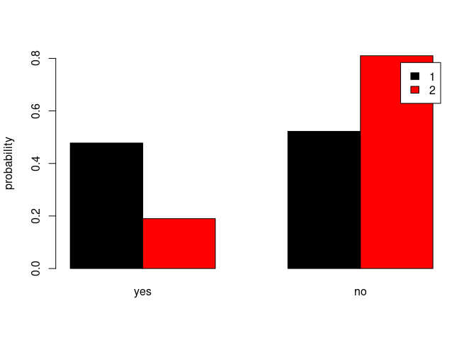
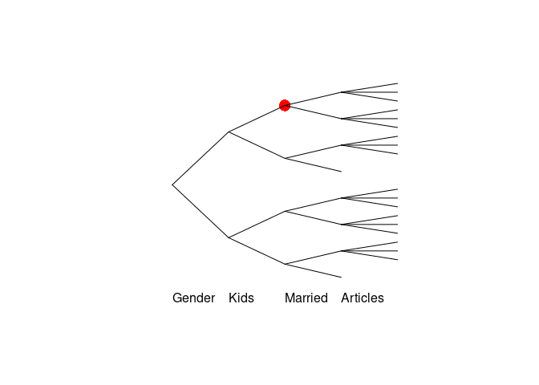

<!-- README.md is generated from README.Rmd. Please edit that file -->

# stagedtrees

[](https://cran.r-project.org/package=stagedtrees)
[](https://travis-ci.com/gherardovarando/stagedtrees)
[](https://codecov.io/github/gherardovarando/stagedtrees?branch=main)
[](https://cran.r-project.org/package=stagedtrees)

##### Preprint

F Carli, M Leonelli, E Riccomagno, G Varando, The R Package stagedtrees
for Structural Learning of Stratified Staged Trees, 2020
[arXiv:2004.06459](https://arxiv.org/abs/2004.06459)

    @misc{2004.06459,
    Author = {Federico Carli and Manuele Leonelli and Eva Riccomagno and Gherardo Varando},
    Title = {The R Package stagedtrees for Structural Learning of Stratified Staged Trees},
    Year = {2020},
    Eprint = {arXiv:2004.06459},
    }

### Overview

`stagedtrees` is a package that implements staged event trees, a
probability model for discrete random variables.

### Installation

``` r
#stable version from CRAN 
install.packages("stagedtrees")

#development version from github
# install.packages("devtools")
devtools::install_github("gherardovarando/stagedtrees")
```

### Usage

``` r
library("stagedtrees")
```

With the `stagedtrees` package it is possible to fit (stratified) staged
event trees to data, use them to compute probabilities, make
predictions, visualize and compare different models.

#### Creating the model

A staged event tree object (`sevt` class) can be initialized as the full
(saturated) or as the fully independent model with, respectively, the
functions `indep` and `full`. It is possible to build a staged event
tree from data stored in a `data.frame` or a `table` object.

``` r
# Load the PhDArticles data
data("PhDArticles")

# define order of variables
order <- c("Gender", "Kids",  "Married", "Articles")

# Independence model 
mod_indep <- indep(PhDArticles, order)
mod_indep
#> Staged event tree (fitted) 
#> Gender[2] -> Kids[2] -> Married[2] -> Articles[3]  
#> 'log Lik.' -2774.754 (df=7)

# Full (saturated) model
mod_full <- full(PhDArticles, order) 
mod_full
#> Staged event tree (fitted) 
#> Gender[2] -> Kids[2] -> Married[2] -> Articles[3]  
#> 'log Lik.' -2546.796 (df=21)
```

##### Structural zeros and unobserved situations

By default staged trees object are defined assuming structural zeros in
the contingency tables. This is implemented by joining all unobserved
situations in particular stages (named by default `"UNOBSERVED"`) which
are, by default, ignored by other methods and functions (see the
`ignore` argument in `?stages_bhc` or `?plot.sevt`).

``` r
## there are no observations for Gender=male (female), Kids = yes, Married = no
get_stage(mod_full, c("male", "yes", "no"))
#> [1] "UNOBSERVED"

## and obviously 
prob(mod_full, c(Kids = "yes", Married = "no"))
#> [1] 0
```

###### Initialize a model without structural zeros

It is possible to initialize a staged tree without structural zeros by
setting the argument `join_unobserved=FALSE`. In that case, it can be
useful to set `lambda > 0` to avoid problems with probabilities on
unobserved situations.

``` r
mod_full0 <- full(PhDArticles, join_unobserved = FALSE, lambda = 1)
```

#### Model selection

`stagedtrees` implements methods to perform automatic model selection.
All methods can be initialized from an arbitrary staged event tree
object.

##### Score methods

This methods perform optimization for a given score using different
heuristics.

  - **Hill-Climbing** `stages_hc(object, score, max_iter, scope, ignore,
    trace)`

<!-- end list -->

``` r
mod1 <- stages_hc(mod_indep)
mod1
#> Staged event tree (fitted) 
#> Gender[2] -> Kids[2] -> Married[2] -> Articles[3]  
#> 'log Lik.' -2555.887 (df=10)
```

  - **Backward Hill-Climbing** `stages_bhc(object, score, max_iter,
    scope, ignore, trace)`

<!-- end list -->

``` r
mod2 <- stages_bhc(mod_full)
mod2
#> Staged event tree (fitted) 
#> Gender[2] -> Kids[2] -> Married[2] -> Articles[3]  
#> 'log Lik.' -2555.887 (df=10)
```

  - **Backward Fast Hill-Climbing** `stages_fbhc(object, score,
    max_iter, scope, ignore, trace)`

<!-- end list -->

``` r
mod3 <- stages_fbhc(mod_full, score = function(x) -BIC(x))
mod3
#> Staged event tree (fitted) 
#> Gender[2] -> Kids[2] -> Married[2] -> Articles[3]  
#> 'log Lik.' -2555.887 (df=10)
```

##### Clustering methods

  - **Backward Joining** `stages_bj(object, distance, thr, scope,
    ignore, trace)`

<!-- end list -->

``` r
mod4 <- stages_bj(mod_full)
mod4
#> Staged event tree (fitted) 
#> Gender[2] -> Kids[2] -> Married[2] -> Articles[3]  
#> 'log Lik.' -2561.404 (df=9)
```

  - **Hierarchical Clustering** `stages_hclust(object, distance, k,
    method, ignore, limit, scope)`

<!-- end list -->

``` r
mod5 <- stages_hclust(mod_full,
                    k = 2, 
                    distance = "totvar",
                   method = "mcquitty")
mod5
#> Staged event tree (fitted) 
#> Gender[2] -> Kids[2] -> Married[2] -> Articles[3]  
#> 'log Lik.' -2554.904 (df=11)
```

  - **K-Means Clustering** `stages_kmeans(object, k, algorithm, ignore,
    limit, scope, nstart)`

<!-- end list -->

``` r
mod6 <- stages_kmeans(mod_full,
                    k = 2, 
                   algorithm = "Hartigan-Wong")
mod6
#> Staged event tree (fitted) 
#> Gender[2] -> Kids[2] -> Married[2] -> Articles[3]  
#> 'log Lik.' -2554.904 (df=11)
```

#### Combining model selections with `%>%`

The pipe operator from the `magrittr` package can be used to combine
easily various model selection algorithms and to specify models easily.

``` r
library(magrittr)
model <- PhDArticles %>% full(lambda = 1) %>% 
           stages_hclust %>% stages_hc

## extract a sub_tree and join two stages
sub_model <- model %>% subtree(path = c(">2"))  %>%  
              join_stages("Mentor", "1", "2")
```

#### Probabilities, predictions and sampling

##### Marginal probabilities

Obtain marginal probabilities with the `prob` function.

``` r
# estimated probability of c(Gender = "male", Married = "yes")
# using different models
prob(mod_indep, c(Gender = "male", Married = "yes")) 
#> [1] 0.357567
prob(mod3, c(Gender = "male", Married = "yes"))
#> [1] 0.4163934
```

Or for a `data.frame` of observations:

``` r
obs <- expand.grid(mod_full$tree)
p <- prob(mod2, obs)
cbind(obs, P = p)
#>    Gender Kids Married Articles          P
#> 1    male  yes      no        0 0.00000000
#> 2  female  yes      no        0 0.00000000
#> 3    male   no      no        0 0.03711667
#> 4  female   no      no        0 0.06437935
#> 5    male  yes     yes        0 0.07751799
#> 6  female  yes     yes        0 0.02627729
#> 7    male   no     yes        0 0.04762758
#> 8  female   no     yes        0 0.04762758
#> 9    male  yes      no      1-2 0.00000000
#> 10 female  yes      no      1-2 0.00000000
#> 11   male   no      no      1-2 0.05722715
#> 12 female   no      no      1-2 0.09926125
#> 13   male  yes     yes      1-2 0.11951865
#> 14 female  yes     yes      1-2 0.04051480
#> 15   male   no     yes      1-2 0.07343307
#> 16 female   no     yes      1-2 0.07343307
#> 17   male  yes      no       >2 0.00000000
#> 18 female  yes      no       >2 0.00000000
#> 19   male   no      no       >2 0.02915345
#> 20 female   no      no       >2 0.05056705
#> 21   male  yes     yes       >2 0.06088686
#> 22 female  yes     yes       >2 0.02063961
#> 23   male   no     yes       >2 0.03740930
#> 24 female   no     yes       >2 0.03740930
```

##### Predictions

A staged event tree object can be used to make predictions with the
`predict` method. The class variable can be specified, otherwise the
first variable (root) in the tree will be used.

``` r
## check accuracy over the PhDArticles data
predicted <- predict(mod3, newdata = PhDArticles)
table(predicted, PhDArticles$Gender)
#>          
#> predicted male female
#>    male    311    145
#>    female  183    276
```

Conditional probabilities (or log-) can be obtained setting `prob =
TRUE`:

``` r
## obtain estimated conditional probabilities in mod3 for first 5 obs
## P(Articles|Gender, Kids, Married)
predict(mod3, newdata = PhDArticles[1:5,], prob = TRUE)
#>        male    female
#> 1 0.5000000 0.5000000
#> 2 0.3656958 0.6343042
#> 3 0.3656958 0.6343042
#> 4 0.7468354 0.2531646
#> 5 0.3656958 0.6343042
```

##### Sampling

``` r
sample_from(mod4, 5)
#>   Gender Kids Married Articles
#> 1   male   no     yes       >2
#> 2   male   no     yes      1-2
#> 3   male  yes     yes      1-2
#> 4   male   no      no      1-2
#> 5 female  yes     yes        0
```

#### Explore the model

##### Model info

``` r
# variables 
variable.names(mod1)
#> NULL

# stages
stages(mod1, "Kids")
#> [1] "3" "1"

# summary
summary(mod1)
#> Call: 
#> stages_hc(mod_indep)
#> lambda:  0 
#> Stages: 
#>   Variable:  Gender 
#>  stage npaths sample.size      male    female
#>      1      0         915 0.5398907 0.4601093
#>   ------------ 
#>   Variable:  Kids 
#>  stage npaths sample.size       yes        no
#>      3      1         494 0.4777328 0.5222672
#>      1      1         421 0.1900238 0.8099762
#>   ------------ 
#>   Variable:  Married 
#>  stage npaths sample.size        no       yes
#>      3      2         316 0.0000000 1.0000000
#>      4      1         258 0.4379845 0.5620155
#>      1      1         341 0.5747801 0.4252199
#>   ------------ 
#>   Variable:  Articles 
#>       stage npaths sample.size         0      1-2        >2
#>  UNOBSERVED      2           0        NA       NA        NA
#>           1      6         915 0.3005464 0.463388 0.2360656
#>   ------------
```

##### Plot

``` r
plot(mod4, main = "Staged tree learned with bj.sevt", 
     cex_label_edges = 0.6, cex_nodes = 1.5)
```

<!-- -->

By default stages associated with the unobserved situations are not
plotted, if the model has been created with `join_unobserved = TRUE`.
But we can plot also the unobserved stages in a specific color.

``` r
plot(stndnaming(mod5, uniq = TRUE), 
     main = "Staged tree learned with stages_hclust 
     (unobserved in grey)",  
     ignore = FALSE, ## do not ignore stages
     col = function(stages) ifelse(stages=="UNOBSERVED", "grey", stages),
     cex_label_edges = 0.6, cex_nodes = 1.5)
```

<!-- -->

###### Barplot

`barplot_stages` permit to easily plot barplots (via `barplot`)
representing the different probabilities defined for the different
stages of a variable.

``` r
barplot(mod4, "Kids", legend.text = TRUE)
```

<!-- -->

##### Subtrees

A subtree can be extracted, the result is another staged event tree
object in the remaining variables.

``` r
sub <- subtree(mod4, c("female"))
plot(sub)
```

<!-- -->

#### Comparing models

Check if models are equal.

``` r
compare_stages(mod1, mod4)
#> [1] FALSE

compare_stages(mod1, mod4, method = "hamming", plot = TRUE, 
             cex_label_nodes = 0, cex_label_edges = 0)
```

<!-- -->

    #> [1] FALSE
    
    hamming_stages(mod1, mod4)
    #> [1] 1
    
    difftree <- compare_stages(mod1, mod4, method = "stages", plot = FALSE, 
                 return_tree = TRUE)
    
    difftree$Married
    #> [1] 0 1 0 1

Penalized log-likelihood.

``` r
BIC(mod_indep, mod_full, mod1, mod2, mod3, mod4, mod5)
#>           df      BIC
#> mod_indep  7 5597.240
#> mod_full  21 5236.789
#> mod1      10 5179.964
#> mod2      10 5179.964
#> mod3      10 5179.964
#> mod4       9 5184.178
#> mod5      11 5184.816
```
